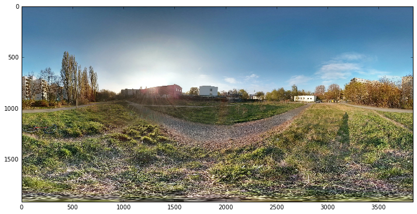
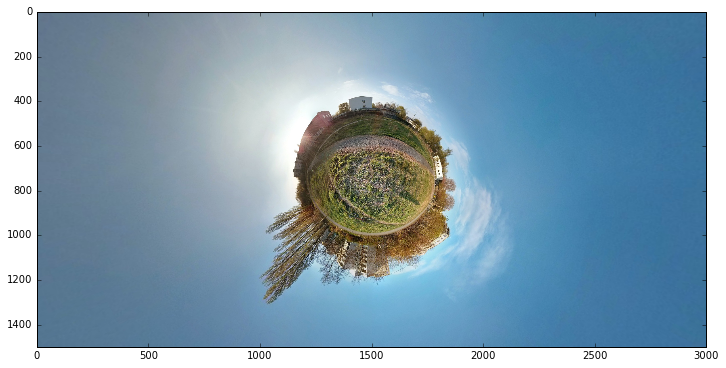
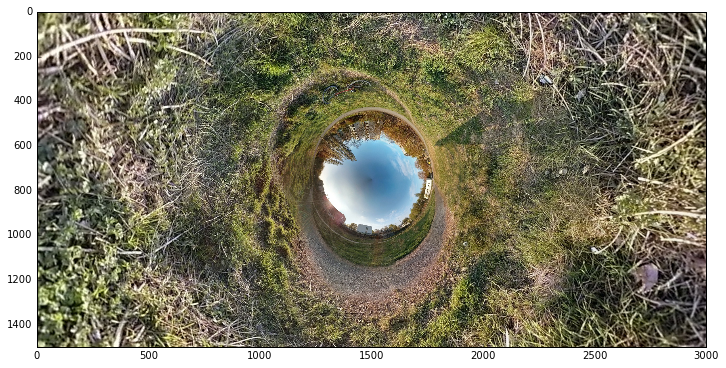
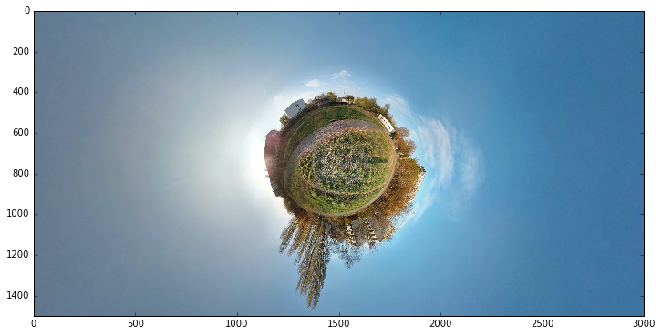

# What are we talking about when we talk about little planet?
The answer to this question is **we are testing Python codes to create little planet images**.

To following question is **what is a little planet?** and I will answer **ask google**. But basically it's the result of remapping a full spherical panorama [presented as an equirectangular image projection] to a stereograpic projection - at least it is how I/we do it when I/we use **Hugin**.

It's called little planet images because the resulting images look like a little planet.

## What are we doing in this notebook?
We use Python to control **Hugin** such that we don't need to open **Hugin** every time we want to create a Little Planet (LP). The key thing being to be able to generate a configuration file [template.pto or some_file_name.pto] for a given image.

In that notebook we do:
+ load EquiRectangular Panorama image
+ create Config file pto for a standard LP
+ apply the config file to create a LP

And after we do more and we show some insider tips how to configurate the config file. Do you follow? If yes here are the next interesting points:
+ config file pfo for an inverse Little Planet
+ config file pto for applying a rotation angle to the Little Planet
+ config file pto for applying rotation to a inverse Little Planet


```python
import cv2
import os, sys
import matplotlib.pyplot as plt
%matplotlib inline
import numpy as np

# this module is my module toolbool to control hugin using Python. There supposes to be real 
# Python biding of Hugin but I never really undertood to use this feature.
from little_planet_tools import little_planet_tools as lpt
reload(lpt)
```


    <module 'little_planet_tools.little_planet_tools' from 'little_planet_tools/little_planet_tools.pyc'>


## Load EquiRectangular Panorama image
The ratio should be 2 for 1.

Why is it important to have such ratio? You can read the doc in **Hugin** to know more about panorama picture and spherical stuffs.


```python
im_pano_equirectangular_name = "test_pano_equi_rectangular.jpg"
im_pano_equi = cv2.imread(im_pano_equirectangular_name)
im_pano_equi = cv2.cvtColor(im_pano_equi, cv2.COLOR_BGR2RGB)

print "Image ratio is %2.0f." % (np.shape(im_pano_equi)[1]/np.shape(im_pano_equi)[0])
fig = plt.figure(figsize=(12, 15))
plt.imshow(im_pano_equi)
```

    Image ratio is  2.


    <matplotlib.image.AxesImage at 0x10b069790>





## Config file pto for creating a standard Little Planet
We need to:
+ create the config file
+ run hugin in command line which call the config file just created
+ display the resulting image

Once again you can check the meaning of the parameters by checking the **Hugin** documentation.

You can also check the functions used below and see which parameters can be changed in order to make the litte planet smaller or bigger.


```python
# create pto
config_file_name = 'test_basic_config'
lpt.fun_create_config_for_littleplanet(im_pano_equirectangular_name, 
                                       output_file_name=config_file_name, 
                                       output_distance= 318)
```


```python
# apply command
lpt.fun_transform_pano2littleplanet(im_pano_equirectangular_name, 
                                    config_file_name = config_file_name,
                                    pano_littleplanet_name = "pano_lpt_test3333.jpg",
                                    destination_head_path="//")
```

    /Users/jeremie/Pictures//
    ../../../Applications/HuginTools/nona -o imLittlePanet33 -m TIFF test_basic_config.pto test_pano_equi_rectangular.jpg


```python
# load create little planet and display
im_little_planet = cv2.imread("pano_lpt_test3333.jpg")
im_little_planet = cv2.cvtColor(im_little_planet, cv2.COLOR_BGR2RGB)

fig = plt.figure(figsize=(12, 15))
plt.imshow(im_little_planet)
plt.draw()
plt.show()
```





## Config file pfo for an inverse Little Planet or down to the rabbit hole

Actually you can do a lot with an equirectangular panorama picture, there is room for experimentation. What if for example you would want to have the sky in the middle and the ground around?

We will follow the same procedure as above, but with new values set for the input parameters to create a config file.


```python
# create pto
config_file_name = 'inverse_config'
lpt.fun_create_config_for_littleplanet(im_pano_equirectangular_name, 
                                       output_file_name=config_file_name, 
                                       output_distance= 318, 
                                       p_angle = -90)
```


```python
# apply command
lpt.fun_transform_pano2littleplanet(im_pano_equirectangular_name, 
                                    config_file_name = config_file_name,
                                    pano_littleplanet_name = "pano_lpt_test3333.jpg",
                                    destination_head_path="//")
```

    /Users/jeremie/Pictures//
    ../../../Applications/HuginTools/nona -o imLittlePanet33 -m TIFF inverse_config.pto test_pano_equi_rectangular.jpg


```python
# load the inverse little planet and display
im_little_planet = cv2.imread("pano_lpt_test3333.jpg")
im_little_planet = cv2.cvtColor(im_little_planet, cv2.COLOR_BGR2RGB)

fig = plt.figure(figsize=(12, 15))
plt.imshow(im_little_planet)
plt.draw()
plt.show()
```





## Config file pto for applying a rotation angle to the Little Planet

And now even better. During your photoshoot where the first full spherical image was taken you may not be satisfied the way the final image is oriented. You can also tune inclinaison by seting up the right parameters.

Following the same idea you can also rotate the inverse little planets.


```python
# create pto with a rotation angle of 60 degree clockwise
config_file_name = 'test_rotation_basic_config'
lpt.fun_create_config_for_littleplanet(im_pano_equirectangular_name, 
                                       output_file_name=config_file_name, 
                                       output_distance= 318, 
                                       r_angle = -90, p_angle = 60, y_angle = -90)
```


```python
# apply command
lpt.fun_transform_pano2littleplanet(im_pano_equirectangular_name, 
                                    config_file_name = config_file_name,
                                    pano_littleplanet_name = "pano_lpt_test3333.jpg",
                                    destination_head_path="//")
```

    /Users/jeremie/Pictures//
    ../../../Applications/HuginTools/nona -o imLittlePanet33 -m TIFF test_rotation_basic_config.pto test_pano_equi_rectangular.jpg


```python
# load the rotated little planet and display
im_little_planet = cv2.imread("pano_lpt_test3333.jpg")
im_little_planet = cv2.cvtColor(im_little_planet, cv2.COLOR_BGR2RGB)

fig = plt.figure(figsize=(12, 15))
plt.imshow(im_little_planet)
plt.draw()
plt.show()
```





```python

```
