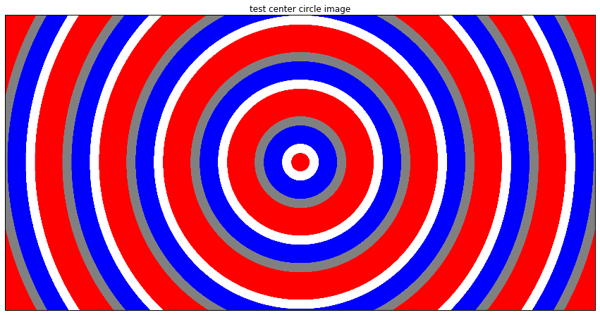
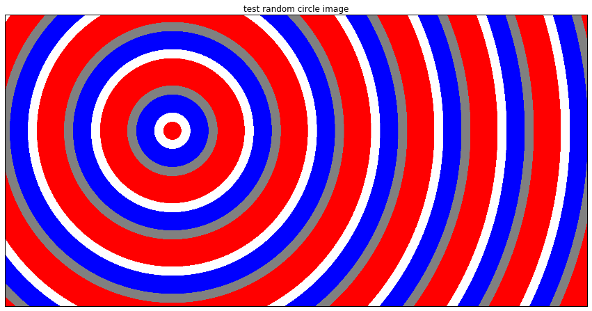
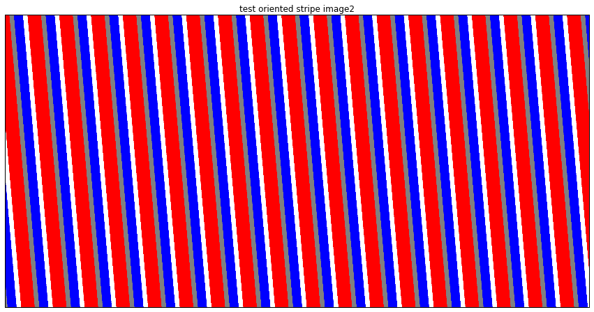
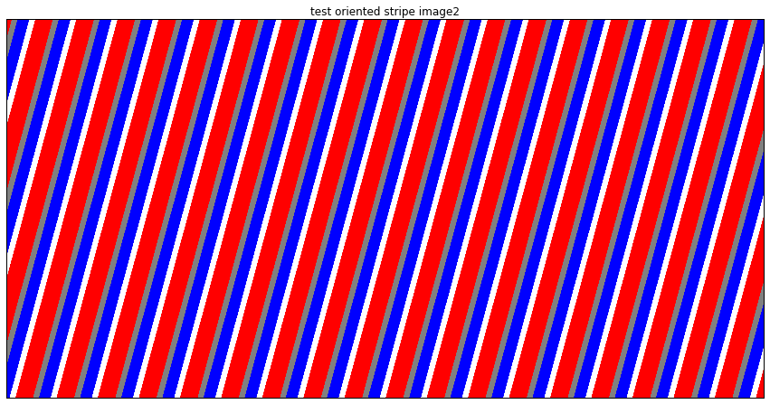
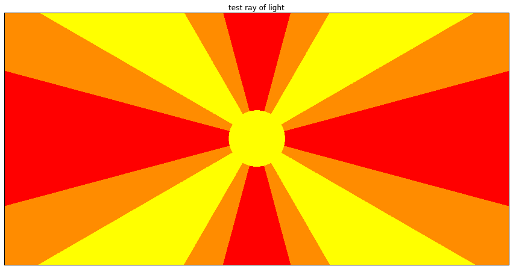
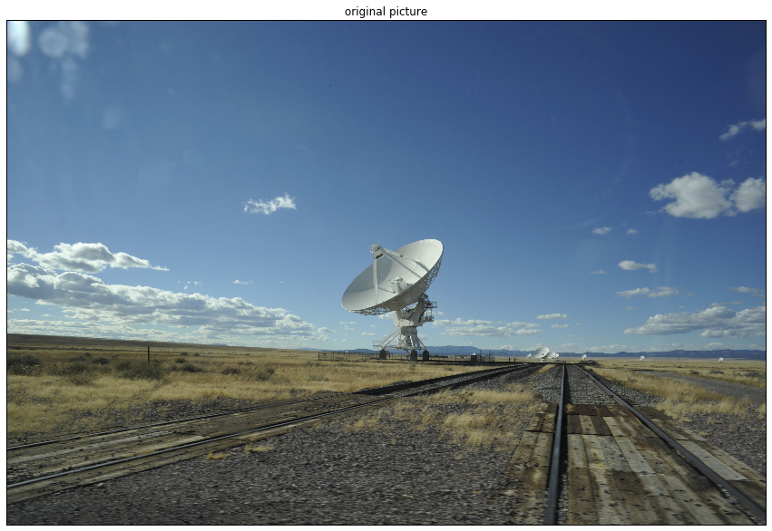
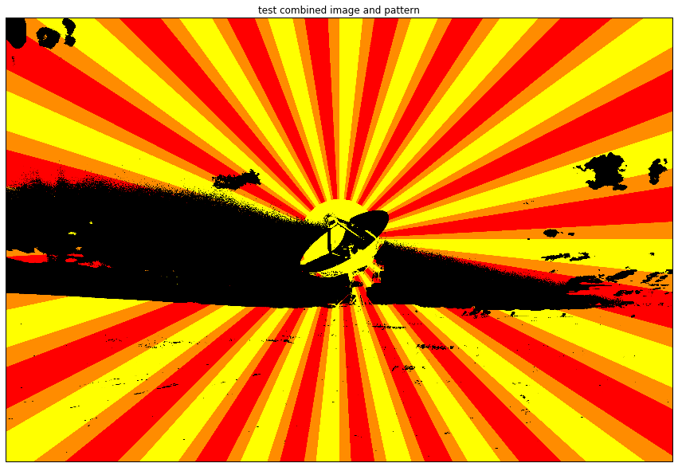

# Background Image Tools

Here we test the module **background_image_tools**.

The tools allow to easily background colored images made of regulat patterns. Patterns made of colored stripes or colored circles.

It should answer the following questions:

+ what are the available tools?
+ how to create a colored stripe image
+ how to create a colored circe image
+ how to apply the pattern image to another image for funky results


```python
import cv2
import os, sys
import matplotlib.pyplot as plt
%matplotlib inline
from scipy import ndimage
import numpy as np

# my module with the code inside for manipulating the little planet
try: 
    import background_image_tools as bacit
except ImportError:
    if sys.path[-1] != "/Users/jeremie/Documents/background_image_tools":
        sys.path.append("/Users/jeremie/Documents/background_image_tools")
        import background_image_tools as bacit
    else:
        print "We should call Houston..."
```

## Discover the module


```python
help(bacit)
```

    Help on module background_image_tools:
    
    NAME
        background_image_tools
    
    FILE
        /Users/jeremie/Documents/little_planet_tools/background_image_tools.py
    
    DESCRIPTION
        # This module contains functions to create images with repeatitive patterns.
        #   - pattern made of colored circles
        #   - pattern made if colored stripes
    
    FUNCTIONS
        apply_pattern_mask(image_data, pattern_image_data, equalize_parameter=False, binary_inv=False, threshold_parameter=128)
            The function assumes a RGB images as input. It will threshold this image,
            then create a mask version of it and will combine it with colorfull pattern
            image.
            
            In:
                image_data (numpy array): n x m x3
                pattern_image_data (numpy array): n x m x 3
            Out:
                image_masked_and_pattern (numpy array): n x m x 3
        
        create_circle_and_ray_of_light(pattern_size, color_stripes, angle_step=60, angle_alpha=0, circle_size=0.1)
            The function draws a pattern that looks like the sun in the center of the
            frame with manga style ray of light going in every directions from the
            center. Key word is obviously center.
            In:
                pattern_size (numpy array): two element vectors giving the image pattern
                                            size
                color_stripes (numpy array): size n x 3 for n different rgb color
                number_circle (int): a number defining how many circles will be plotted
                                on the image pattern
            Out:
                sunray_img (numpy array): image of size of the pattern_size but with 3
                channels for R, G and B.
        
        create_circle_pattern(pattern_size, color_circles, source_circle='center', number_circle=8)
            The function creates image made of colored circles where the color
            sequence is repated until the image is covered.
            
            In:
                pattern_size (numpy array): two element vectors giving the image pattern
                size
                color_circles (numpy array): size n x 3 for n different rgb color
                number_circle (int): a number defining how many circles will be plotted
                on the image pattern
            Out:
                circle_img (numpy array): image of size of the pattern_size but with 3
                channels for R, G and B.
        
        create_stripes_pattern(pattern_size, color_stripes, number_stripes=8, angle_stripe=0)
            The function creates image made of colored stripes where the color
            sequence is repated until the image is covered.
            
            In:
                pattern_size (numpy array): two element vectors giving the image pattern
                size
                color_stripes (numpy array): size n x 3 for n different rgb color
                number_circle (int): a number defining how many circles will be plotted
                on the image pattern
                alpha (int): a parameter defining how the stripes are tilted
            
            Out:
                stripe_img (numpy array): image of size of the pattern_size but with 3
                channels for R, G and B.
        
        display_image(image_data, image_name_for_title)
            Thte function display an image, panorama image of little planet.
        
        rotate_image(image_rgb, angle_rotation=2)
            The function rotate an image of angle_rotation degrees.
    
    


## Let's do some colored circles images

As exemple we create circle pattern of color blue, white and red.


```python
color_ = [
(255, 255, 255), # white
(255, 0, 0),     # red
(255, 0, 0),     # red
(255, 0, 0),     # red
(128, 128, 128), # middle gray    
(0, 0, 255),  # blue
(0, 0, 255)  # blue
]
circle_img_center = bacit.create_circle_pattern((4000,2000),
                                        color_,
                                         source_circle = "center",
                                         number_circle=32)

circle_img_random = bacit.create_circle_pattern((4000,2000),
                                        color_,
                                         source_circle = "random",
                                         number_circle=32)
bacit.display_image(circle_img_center, 'test center circle image')
bacit.display_image(circle_img_random, 'test random circle image')
```

    4472.0
    4472.0








## Let's do some colored stripes images

As exemple we create stripe pattern of color blue, white and red.


```python
reload(bacit)

color_ = [
(255, 255, 255), # white
(255, 0, 0),     # red
(255, 0, 0),     # red
(255, 0, 0),     # red
(128, 128, 128), # middle gray    
(0, 0, 255),  # blue
(0, 0, 255)  # blue
]
strip_img1 = bacit.create_stripes_pattern((4000,2000),
                                        color_,
                                        number_stripes=128,
                                        angle_stripe = 5)

angle_random = np.random.rand(1)*90 - 45
print "Angle is %s degrees." % angle_random
strip_img2 = bacit.create_stripes_pattern((4000,2000),
                                        color_,
                                        number_stripes=128,
                                        angle_stripe = angle_random)

bacit.display_image(strip_img1,'test oriented stripe image2')
bacit.display_image(strip_img2,'test oriented stripe image2')
```

    Angle is [-15.10695917] degrees.








## How to save this pattern images?

Pretty easy I would say.


```python
pattern_img = cv2.cvtColor(strip_img1, cv2.COLOR_BGR2RGB)
cv2.imwrite("pattern_stripes.jpg", pattern_img)
```


    True


```python
!ls *jpg
```

    pattern_stripes.jpg test_image.jpg


## Let's do some ray of light effect


```python
reload(bacit)
pattern_size = (2000, 4000)
color_ = [(255, 255, 0),
          (255, 255, 0),
          (255,140,0),
          (255, 0, 0),
          (255, 0, 0),
          (255,140,0)]

sunray_img = bacit.create_circle_and_ray_of_light(pattern_size, color_, angle_step = 15, angle_alpha = 30, circle_size=0.05)

bacit.display_image(sunray_img,"test ray of light")

```





```python

```

## How to apply the pattern images to normal images

Once again I made it easy.


```python
reload(bacit)
# first we load a test image
test_image_BGR = cv2.imread("/Users/jeremie/Documents/little_planet_tools/test_image.jpg")
test_image_RGB = cv2.cvtColor(test_image_BGR, cv2.COLOR_BGR2RGB)

# create a pattern image of the same test_image size
pattern_size = (np.shape(test_image_BGR)[1],np.shape(test_image_BGR)[0])

pattern_image_RGB1 = bacit.create_circle_pattern(pattern_size,
                                            color_,
                                            source_circle = "random",
                                            number_circle=32)

pattern_image_RGB2 = bacit.create_circle_and_ray_of_light(pattern_size, 
                                                         color_, 
                                                         angle_step = 3, 
                                                         angle_alpha = 30, 
                                                         circle_size=0.05)

pattern_image_BGR = cv2.cvtColor(pattern_image_RGB1, cv2.COLOR_RGB2BGR)

print np.shape(test_image_BGR), type(pattern_image_RGB1)
print np.shape(pattern_image_RGB1), type(pattern_image_RGB1)
print np.shape(pattern_image_RGB2), type(pattern_image_RGB2)
```

    5112.0
    (2832, 4256, 3) <type 'numpy.ndarray'>
    (2832, 4256, 3) <type 'numpy.ndarray'>
    (2832, 4256, 3) <type 'numpy.ndarray'>


```python
# combine test_image and a pattern image
combined_img_RGB = bacit.apply_pattern_mask(test_image_RGB, pattern_image_RGB2, 
                                        equalize_parameter = False, 
                                        binary_inv = False,
                                        threshold_parameter = 140)

bacit.display_image(test_image_RGB,"original picture")
bacit.display_image(combined_img_RGB,"test combined image and pattern")
```







